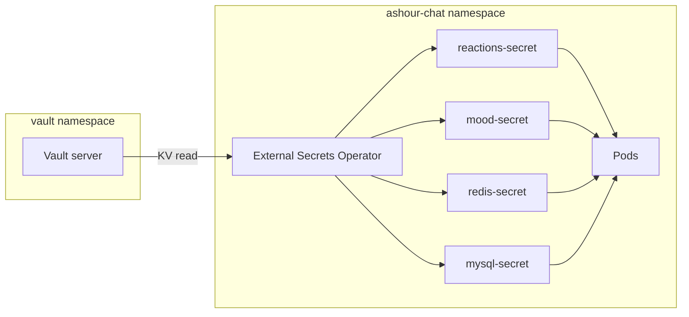

# Install Vault and integrate with ashour-chat

## Current state

- **Secrets** are defined in [helm/ashour-chat/values.yaml](helm/ashour-chat/values.yaml) under `secrets.*` and rendered into four Kubernetes Secrets: `reactions-secret`, `mood-secret`, `redis-secret`, `mysql-secret`. Pods reference them via `secretKeyRef` (no app code change needed if we keep the same Secret names and keys).
- **No Vault or External Secrets** exist in the repo today.

## Approach: Vault + External Secrets Operator (ESO)

Use **Vault** as the source of truth for secrets and **External Secrets Operator** to sync them into the same K8s Secrets the app already uses. Pod specs stay unchanged; only the origin of the Secret data changes (Vault instead of Helm values).

---

## 1. Install and configure Vault

- **Helm chart**: Use official HashiCorp Vault chart (`hashicorp/vault`).
- **Namespace**: Dedicated `vault` (e.g. `kubectl create namespace vault`).
- **Install**: Add repo `hashicorp https://helm.releases.hashicorp.com`, install with values that:
  - Run a single Vault server (e.g. `server.standalone.enabled: true` for dev/simple setup).
  - Optionally inject a startup script or use dev mode for local clusters; for a “works out of the box” experience, dev mode is simplest (unsealed by default); for production, document unseal and storage (e.g. file or Raft).
- **Post-install steps** (document in README and optionally in a small script or Make target):
  - Enable KV v2 at path `secret`: `vault secrets enable -path=secret kv-v2`.
  - Enable Kubernetes auth: `vault auth enable kubernetes` and configure it to use the cluster’s token review JWT and CA (service account in `vault` namespace).
  - Create a policy that allows read of `secret/data/ashour-chat` and create a role that binds that policy to the app namespace (e.g. service account used by ESO in `ashour-chat`).
  - Seed the engine with keys expected by ESO: `redisPassword`, `mysqlRootPassword`, `mysqlUser`, `mysqlPassword`, `jwtSecret` (values from env or a one-time `vault kv put`).

Store install/values in something like `**vault/helm-values.yaml**` (or a `vault/` directory with values + optional bootstrap script) so the project has a single place for “how we run Vault here”.

---

## 2. Install External Secrets Operator

- **Helm chart**: `external-secrets/external-secrets` (or `external-secrets-operator`).
- **Namespace**: Either a dedicated `external-secrets` namespace or the same `ashour-chat` namespace; dedicated is cleaner so ESO can sync into any namespace.
- **Config**: Create a **SecretStore** (or ClusterSecretStore) that uses Vault with Kubernetes auth:
  - Vault address (e.g. `http://vault-server.vault.svc:8200`).
  - Kubernetes auth role and path.
  - Reference to the K8s service account used by ESO to talk to Vault (the one bound to the Vault role above).

Add a small values file or snippet under `**vault/` or `external-secrets/**` (e.g. `external-secrets-values.yaml`) if custom config is needed; otherwise document the `helm install` and the SecretStore manifest.

---

## 3. Helm chart changes (ashour-chat)

- **Values** in [helm/ashour-chat/values.yaml](helm/ashour-chat/values.yaml):
  - Add a `vault` section, e.g.:
    - `vault.enabled` (default `false`) so current behavior stays default.
    - `vault.secretStoreName`: name of the SecretStore in the release namespace (e.g. `vault-ashour-chat`).
    - Optional: `vault.path` (default `secret/ashour-chat`) and backend/path overrides if you ever use multiple backends.
  - When `vault.enabled` is true, **do not** render the four inline Secrets (reactions-secret, mood-secret, redis-secret, mysql-secret) from `values.secrets`; instead create **ExternalSecret** resources that sync from Vault into those same Secret names with the same keys the pods expect.
- **Templates**:
  - **Conditional Secrets**: Wrap the existing Secret manifests for `reactions-secret`, `mood-secret`, `redis-secret`, `mysql-secret` in `{{- if not .Values.vault.enabled }} ... {{- end }}`.
  - **New ExternalSecret manifests** (one file or multiple): create only when `vault.enabled` is true. Each ExternalSecret:
    - References the configured SecretStore.
    - Uses `secret/data/ashour-chat` (or `vault.path`) and maps Vault keys to the existing K8s Secret keys:
      - **reactions-secret / mood-secret**: Vault `redisPassword` → `REDIS_PASSWORD`, `mysqlUser` → `MYSQL_USER`, `mysqlPassword` → `MYSQL_PASSWORD`, `jwtSecret` → `JWT_SECRET`.
      - **redis-secret**: Vault `redisPassword` → `redis-password` (to match [data-redis.yaml](helm/ashour-chat/templates/data-redis.yaml) which uses key `redis-password`).
      - **mysql-secret**: Vault `mysqlRootPassword` → `MYSQL_ROOT_PASSWORD`, `mysqlUser` → `MYSQL_USER`, `mysqlPassword` → `MYSQL_PASSWORD`; `MYSQL_DATABASE` can stay from values (non-sensitive) or be added as a literal in the ExternalSecret.
  - Ensure the app namespace has a **SecretStore** only if you want the chart to create it; otherwise document that the user must create the SecretStore (e.g. from a vault/ or external-secrets/ manifest) before installing with `vault.enabled=true`. Prefer the chart creating a SecretStore when `vault.enabled` is true so one `helm install` is enough, with the user supplying Vault address and auth role (e.g. via values).
- **SecretStore in chart**: When `vault.enabled` is true, template a SecretStore that points at Vault (Kubernetes auth). Vault URL can be a value like `vault.address` (e.g. `http://vault-server.vault.svc:8200`) and `vault.auth.role` for the Kubernetes role name. This keeps the chart self-contained.

---

## 4. Documentation (README)

- **New section “Secrets with Vault”** (or “Installing Vault and using it for secrets”):
  - Prerequisites (cluster, kubectl, helm).
  - **Install order**: 1) Vault (Helm + namespace), 2) Unseal (if not dev mode) and configure KV + Kubernetes auth + policy + role, 3) Seed `secret/ashour-chat` with the five keys, 4) Install ESO, 5) Install or upgrade ashour-chat with `vault.enabled=true` (and any `vault.*` values for address/role/SecretStore).
  - Exact Vault path and key names so users can replicate (e.g. `vault kv put secret/ashour-chat redisPassword=... mysqlUser=...`).
  - How to verify: `kubectl get externalsecrets`, `kubectl get secrets`, and that pods start and can reach Redis/MySQL.
  - Optional: one-line note that for production you should use proper Vault storage and unseal process (and link to HashiCorp docs).

---

## 5. Files to add or touch

| Area       | Action                                                                                                                                          |
| ---------- | ----------------------------------------------------------------------------------------------------------------------------------------------- |
| **Vault**  | Add `vault/helm-values.yaml` (and optionally `vault/bootstrap.sh` or steps in README) for Vault install and KV + K8s auth + policy + seed.      |
| **ESO**    | Add `external-secrets/values.yaml` or document Helm install + SecretStore; or rely on chart-created SecretStore.                                |
| **Helm**   | [values.yaml](helm/ashour-chat/values.yaml): add `vault.enabled`, `vault.path`, `vault.address`, `vault.auth.role`, `vault.secretStoreName`.    |
| **Helm**   | Templates: conditional Secrets; new `externalsecret*.yaml` (or one file with multiple docs) and optional `secretstore.yaml` when vault.enabled. |
| **README** | New section “Secrets with Vault” with install and verification steps.                                                                           |

---

## 6. Optional: CI/pipeline

- No change required for the app build. If you want the pipeline to deploy only when Vault is already present, you could add a job or step that checks for Vault/ESO; otherwise keep the pipeline as-is and document that Vault + ESO must be installed and configured before using `vault.enabled=true`.

---

## Summary

- **Install Vault** (Helm) in `vault` namespace; enable KV v2 and Kubernetes auth; create policy and role; seed `secret/ashour-chat`.
- **Install ESO** and configure a SecretStore for Vault (K8s auth).
- **Chart**: When `vault.enabled` is true, create ExternalSecrets (and optionally SecretStore) instead of the four inline Secrets; same Secret names/keys so pods are unchanged.
- **Docs**: README section with order of operations and verification.

This keeps the app and pod specs unchanged while moving secret storage to Vault and syncing via ESO.